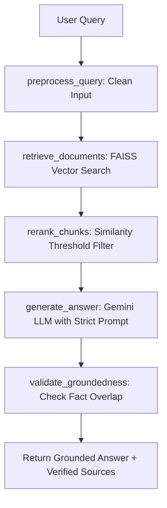

#  DocuMind RAG: Grounded Multi-Format Document Intelligence Assistant

[](https://www.python.org/)
[](https://fastapi.tiangolo.com/)
[](https://streamlit.io/)
[](https://github.com/facebookresearch/faiss)
[](https://langchain-ai.github.io/langgraph/)
[](https://www.docker.com/)


##  Project Overview

**DocuMind RAG** is an enterprise-grade, production-style Retrieval-Augmented Generation (RAG) assistant developed for the **SHADOWFOX Internship Program** (August 1, 2026 – September 2, 2026).

It enables users to upload multi-format documents (`.pdf`, `.txt`, `.md`), index them using local CPU vector embeddings in FAISS, and ask complex domain-specific questions. The system guarantees **strict groundedness** with anti-hallucination guardrails, providing granular source citations down to exact document names, page numbers, and chunk IDs.

##  Problem Statement

Traditional LLMs suffer from knowledge cutoff dates and halluxination when asked about proprietary or recently uploaded documents. Basic RAG prototypes often invent answers when document context is missing. 

**DocuMind RAG** addresses these challenges by combining:
1. **Multi-format parsing & page tracking**.
2. **Local vector similarity search with FAISS**.
3. **Score-threshold reranking** to eliminate irrelevant noise.
4. **LangGraph state machine workflow** to control the query lifecycle.
5. **Dual-layer groundedness validation** that explicitly declines answering if evidence is absent.


##  Key Features

-  **Multi-Format Ingestion**: Supports `.pdf` (with page extraction), `.txt`, and `.md` (Markdown).
-  **Semantic Text Chunking**: Recursive character splitting with contextual overlap.
-  **Local CPU Vector Embeddings**: Utilizes `sentence-transformers/all-MiniLM-L6-v2` (0 cost, no API limits).
-  **FAISS Vector Index**: Cosine similarity vector search with disk persistence (`data/index/`).
-  **Anti-Hallucination Guardrail**: Verifies answer terms against context. State machine forces refusal if ungrounded.
-  **Granular Source Citations**: Accordion view displaying filename, page number, chunk ID, similarity score, and excerpt.
-  **Decoupled Architecture**: FastAPI backend REST microservice + Streamlit web UI frontend.
-  **Dockerized Setup**: Ready-to-run containerization via `docker-compose`.


## System Architecture

```
                                  +-----------------------+
                                  |     Streamlit UI      |
                                  +-----------+-----------+
                                              |
                                              v  HTTP REST (API /v1)
                                  +-----------+-----------+
                                  |    FastAPI Microservice|
                                  +-----------+-----------+
                                              |
                 +----------------------------+----------------------------+
                 |                                                         |
                 v                                                         v
   +-------------+-------------+                             +-------------+-------------+
   |   Document Ingestion      |                             |   LangGraph RAG State Graph |
   +-------------+-------------+                             +-------------+-------------+
   | - PDF / TXT / MD Loaders  |                             | Node 1: Preprocess Query    |
   | - Text Cleaning           |                             | Node 2: FAISS Vector Search |
   | - Recursive Chunker       |                             | Node 3: Threshold Reranker  |
   | - SentenceTransformers    |                             | Node 4: Gemini LLM Engine   |
   | - FAISS Index Persistence |                             | Node 5: Groundedness Check  |
   +---------------------------+                             +---------------------------+
```


##  Technology Stack

| Layer | Technology |
| :--- | :--- |
| **Language** | Python 3.10+ |
| **Backend API** | FastAPI, Uvicorn, Pydantic v2 |
| **Frontend UI** | Streamlit |
| **Vector DB** | FAISS (`faiss-cpu`) |
| **Embeddings** | `sentence-transformers/all-MiniLM-L6-v2` |
| **LLM Engine** | Google Gemini API (`gemini-2.5-flash`) |
| **Orchestration** | LangGraph & LangChain Core |
| **Parsers** | `pypdf`, `markdown` |
| **Containerization** | Docker & Docker Compose |
| **Testing** | `pytest`, `httpx` |


##  Project Structure

```
Advanced-level-project/
├── app/
│   ├── main.py                  # FastAPI server entrypoint
│   ├── config.py                # Pydantic environment configuration
│   ├── api/                     # REST routes & Pydantic schemas
│   ├── ingestion/               # Loaders, parser, & chunker modules
│   ├── embeddings/              # SentenceTransformers embedding service
│   ├── retrieval/               # FAISS vector store, retriever & reranker
│   ├── generation/              # Gemini LLM client & grounded prompts
│   ├── validation/              # Anti-hallucination groundedness checker
│   └── pipeline/                # LangGraph RAG workflow pipeline
├── streamlit_app/
│   ├── app.py                   # Streamlit web UI entrypoint
│   └── components.py            # Custom UI badges & citation components
├── data/
│   ├── uploads/                 # Uploaded raw documents storage
│   └── index/                   # FAISS index binary & metadata storage
├── tests/                       # Pytest unit & integration test suite
├── Dockerfile.backend           # FastAPI container definition
├── Dockerfile.frontend          # Streamlit container definition
├── docker-compose.yml           # Microservice orchestration
├── requirements.txt             # Project Python dependencies
├── .env.example                 # Environment variables template
└── README.md                    # Project documentation
```

---

##  Installation & Setup

### 1. Prerequisites
- Python 3.10 or higher
- Git
- Google Gemini API Key ([Get a free key here](https://aistudio.google.com/))

### 2. Clone & Install Dependencies
```bash
# Clone repository
git clone https://github.com/your-username/DocuMind-RAG.git
cd DocuMind-RAG

# Create virtual environment
python -m venv venv

# Activate virtual environment
# Windows:
venv\Scripts\activate
# Linux/macOS:
source venv/bin/activate

# Install dependencies
pip install -r requirements.txt
```

### 3. Environment Variables
Copy `.env.example` to `.env` and insert your Gemini API Key:
```bash
cp .env.example .env
```
Edit `.env`:
```env
GEMINI_API_KEY=your_actual_gemini_api_key_here
LLM_MODEL_NAME=gemini-2.5-flash
EMBEDDING_MODEL_NAME=sentence-transformers/all-MiniLM-L6-v2
```

---

## Running Locally

### Option A: Run FastAPI + Streamlit Together

**Terminal 1 (FastAPI Backend)**:
```bash
uvicorn app.main:app --host 0.0.0.0 --port 8000 --reload
```
*API Interactive Swagger Docs will be available at:* `http://localhost:8000/docs`

**Terminal 2 (Streamlit Frontend)**:
```bash
streamlit run streamlit_app/app.py
```
*Web App UI will open at:* `http://localhost:8501`

---

##  Running with Docker

You can launch the complete backend and frontend stack with a single Docker Compose command:

```bash
docker-compose up --build
```

- **Streamlit Web UI**: `http://localhost:8501`
- **FastAPI Backend**: `http://localhost:8000/docs`

To stop containers:
```bash
docker-compose down
```

---

## 🧠 How RAG & LangGraph Work



---

##  API Endpoints Summary

| Method | Endpoint | Description |
| :--- | :--- | :--- |
| `GET` | `/api/v1/health` | Health status and vector index metrics |
| `POST` | `/api/v1/upload` | Upload `.pdf`, `.txt`, or `.md` document |
| `POST` | `/api/v1/ingest` | Chunk, embed, and index document in FAISS |
| `POST` | `/api/v1/query` | Execute full LangGraph RAG search pipeline |
| `GET` | `/api/v1/documents` | List indexed documents and chunk statistics |
| `DELETE` | `/api/v1/documents/{filename}` | Remove document and vectors from FAISS index |
| `DELETE` | `/api/v1/clear-index` | Reset index and clear uploads |

---

##  Testing

Run the automated test suite using `pytest`:
```bash
pytest tests/
```

---

##  Limitations & Future Work

- **OCR for Scanned PDFs**: Currently relies on text-extractable PDFs (`pypdf`). Future iterations can integrate Tesseract OCR.
- **Hybrid Search**: Currently uses dense vector embeddings; BM25 keyword hybrid search can be added for keyword precision.
